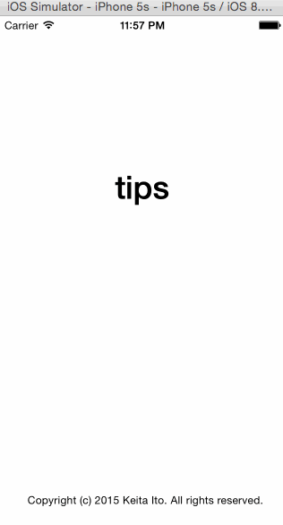

# KeitaTipCalculator

KeitaTipCalculator is an awesome tip calculator app built by Keita Ito. This tip calculator has two main features. One is that you can change tip percentages. The other one is that you can change background color. Both setting is stored in NSUserDefaults, the app can remember your own tip percentages and custom background color.

Time Spent: 8 hours spent in total

Completed user stories:
- [x] Required: Built the basic tip calculator
- [x] Required: Added tip calculator setting page
- [x] Required: Implemented NSUserDefaults to save and load data
- [x] Required: Created custom settings view controller
- [x] Optional: Implemented customizing background color feature

Notes:
Passing tip percentages data and background color data between rootViewController and SettingsViewController with NSUserDefaults. the app loads parameters from NSUserDefaults, so when you open the app for second time, the app remember tip percentages and background color.

Walkthrough of all user stories:

GIF created with [LiceCap](http://www.cockos.com/licecap/).
